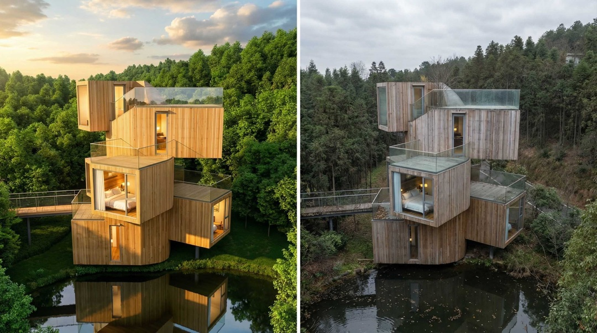
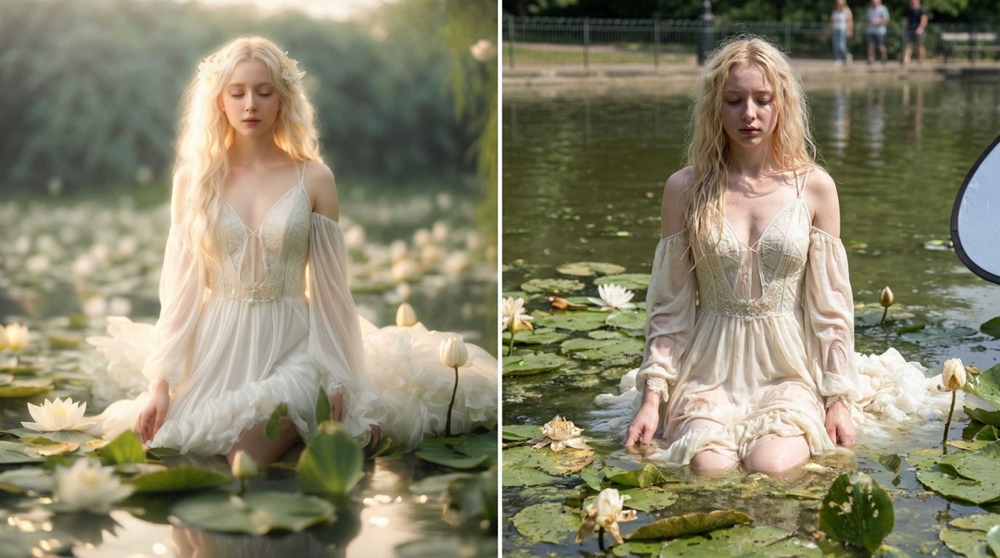
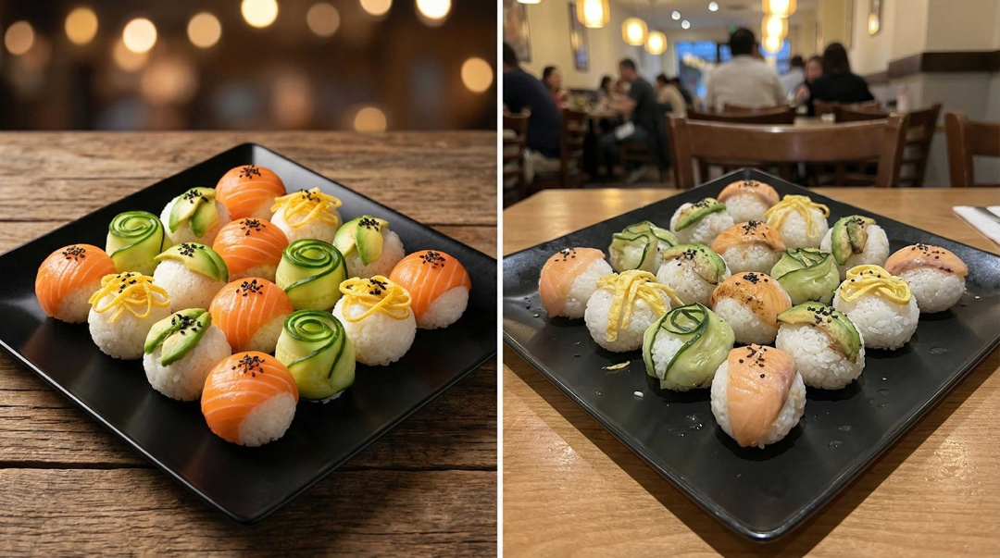

# Anti-Render Skills

Anti-Render 用于把任意领域图片转成“理想承诺 vs 残酷现实”的视觉叙事，支持三种输出：理想渲染 / 真实面貌 / 对比图。

欢迎补充更多领域的 anti-render.json 或示例。也欢迎返图。





请注意，该技能仅为生成一种“讽刺性”娱乐，这并非意味着现实在实际上不堪入目。

## 使用方式

如果你使用 `npx skills` 生态工具，可以指向本目录安装或列出技能：

```bash
npx skills add Lionad-Morotar/anti-render-skill
```

## 示例提示词

把下面任意一句复制粘贴，并配合你上传的图片使用。

```plaintext
使用 anti-render 技能渲染这张图片......
```

或你想极端一些：

```plaintext
对这张图做极端对比...
```

配合旗舰模型或 Agent 使用最佳。以上几个示例使用 [Youmind](https://youmind.com/invite/7EEXEZ) 生成。

## 返图区

...
